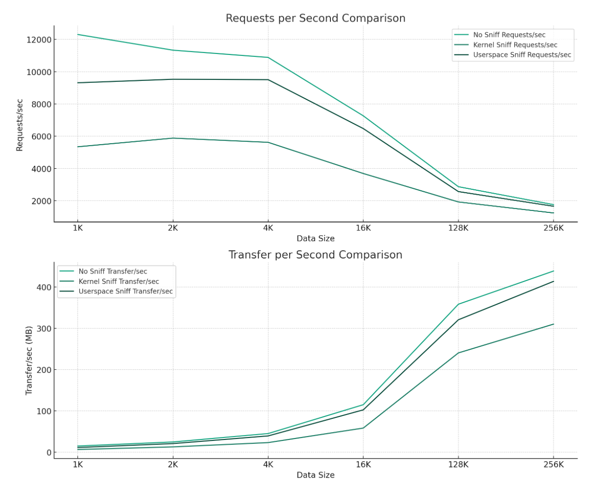

# bpftime-evaluation

Some practical bpf performance tests

## nginx test for sslsniff

> How does kernel uprobe and userspace uprobe affect the performance of the workload?

### Quantitative Analysis of Performance Drops

#### Kernel vs. Userspace Sniffing Impact

- **Kernel Requests Drop**:
  - The drop in requests per second due to kernel-level sniffing ranged from **29.31% to 56.56%** across different data sizes.
  - The largest impact was observed for the smallest data size (1K), where the drop was 56.56%. This suggests a significant overhead associated with kernel-level sniffing, particularly for handling smaller payloads.

- **Userspace Requests Drop**:
  - The drop in requests per second for userspace-level sniffing was lower, ranging from **5.69% to 24.31%**.
  - Again, the impact was more pronounced for smaller data sizes, with a 24.31% drop for 1K payloads, indicating better but still noticeable performance degradation.

see ssl-nginx and gpt: <https://chat.openai.com/share/3b8ded8a-2e67-4cbe-8ea7-b55dfea5191c>

## syscount for tracepint

> How does tracepoint affect the performance of the system, when the process is not targeted?

Syscount: Tracing syscalls, printing top 10...

The similar approach is used widely in observation daemons.

The test result shows that:

- Syscount to trace all results: Mean: 32053.66
- Syscount filter other pid: Mean: 35716.34
- No effect: Mean: 39335.21

If we want to use the tracepoint to trace system calls for a target process, it will also affect other process, bring about `10%` unnecessary overhead. This is because the syscall tracepoint is a global tracepoint, and it will be triggered for all processes. If you want to trace a specific process, you need to filter the pid in the kernel.

What's more, if you want to filter the pid in userspace, it will bring `20%` overhead.

## Deepflow

An example of Deepflow runtime with different uprobe types. Test with golang server, wrk2 client. Show the performance drop of kernel and userspace mixed observation.

- uprobe will bring large overhead
- userspace uprobe will significantly reduce the overhead
- userspace uprobe can support a cross-boundary observation

### results

#### HTTPS Averages

| Size | kernel-uprobe | no-probe | no-uprobe | user-uprobe |
|------|---------------|----------|-----------|-------------|
| 1    | 76343.52 / 83.15 | 159687.78 / 173.92 | 129640.17 / 141.19 | 88601.28 / 96.50 |
| 2    | 77731.49 / 160.57 | 153616.17 / 317.32 | 128003.31 / 264.41 | 92023.17 / 190.09 |
| 4    | 59957.20 / 242.05 | 113415.38 / 457.86 | 98361.25 / 397.09 | 70625.88 / 285.12 |
| 16   | 50640.45 / 797.90 | 92878.51 / 1463.30 | 82047.01 / 1291.26 | 58080.14 / 915.36 |
| 128  | 26226.10 / 3282.94 | 34996.71 / 4378.62 | 31068.57 / 3887.10 | 27718.18 / 3469.31 |
| 256  | 16103.92 / 4027.39 | 19931.38 / 4984.83 | 17540.86 / 4387.84 | 16755.62 / 4193.28 |

#### HTTP Averages

| Size | kernel-uprobe | no-probe | no-uprobe | user-uprobe |
|------|---------------|----------|-----------|-------------|
| 1    | 118499.38 / 129.06 | 256345.72 / 279.19 | 196381.58 / 213.88 | 122848.50 / 133.79 |
| 2    | 116609.60 / 240.88 | 250357.85 / 517.15 | 192184.16 / 396.99 | 121360.12 / 250.69 |
| 4    | 98524.44 / 397.73 | 206790.04 / 834.79 | 162954.94 / 657.83 | 102417.73 / 413.45 |
| 16   | 85274.67 / 1343.49 | 173960.99 / 2742.27 | 133481.71 / 2104.32 | 93158.75 / 1467.39 |
| 128  | 51362.17 / 6426.62 | 83321.26 / 10425.34 | 72278.05 / 9043.97 | 63630.56 / 7961.60 |
| 256  | 30745.06 / 7691.26 | 50518.03 / 12635.14 | 45729.22 / 11439.10 | 42739.36 / 10688.51 |

These tables present the complete data for all sizes (1-256) under each sub-key for both HTTPS and HTTP. The values represent the average request and transfer metrics, which give insights into the network performance characteristics for each size and protocol type.

### Drop

Here are the detailed performance drop percentages for each 'size' under the various sub-keys in both the HTTPS and HTTP data. The performance drop is calculated with 'no-probe' as the 100% baseline.

#### HTTPS Performance Drop

| Size | kernel-uprobe      | no-uprobe           | user-uprobe         |
|------|--------------------|---------------------|---------------------|
| 1    | 52.19% / 52.19%    | 18.82% / 18.82%     | 44.52% / 44.52%     |
| 2    | 49.40% / 49.40%    | 16.67% / 16.67%     | 40.10% / 40.10%     |
| 4    | 47.13% / 47.13%    | 13.27% / 13.27%     | 37.73% / 37.73%     |
| 16   | 45.48% / 45.47%    | 11.66% / 11.76%     | 37.47% / 37.45%     |
| 128  | 25.06% / 25.02%    | 11.22% / 11.23%     | 20.80% / 20.77%     |
| 256  | 19.20% / 19.21%    | 11.99% / 11.98%     | 15.93% / 15.88%     |

#### HTTP Performance Drop

| Size | kernel-uprobe      | no-uprobe           | user-uprobe         |
|------|--------------------|---------------------|---------------------|
| 1    | 53.77% / 53.77%    | 23.39% / 23.39%     | 52.08% / 52.08%     |
| 2    | 53.42% / 53.42%    | 23.24% / 23.24%     | 51.53% / 51.53%     |
| 4    | 52.36% / 52.36%    | 21.20% / 21.20%     | 50.47% / 50.47%     |
| 16   | 50.98% / 51.01%    | 23.27% / 23.26%     | 46.45% / 46.49%     |
| 128  | 38.36% / 38.36%    | 13.25% / 13.25%     | 23.63% / 23.63%     |
| 256  | 39.14% / 39.13%    | 9.48% / 9.47%       | 15.40% / 15.41%     |

The tables present the performance drop in terms of request and transfer metrics for each size, comparing 'kernel-uprobe', 'no-uprobe', and 'user-uprobe' against the 'no-probe' baseline. The values are represented as percentages, indicating the reduction in performance compared to the baseline.

### Diagram

<https://chat.openai.com/share/909d7f95-85dd-4f18-afb1-e8f3c2cee2a5>
